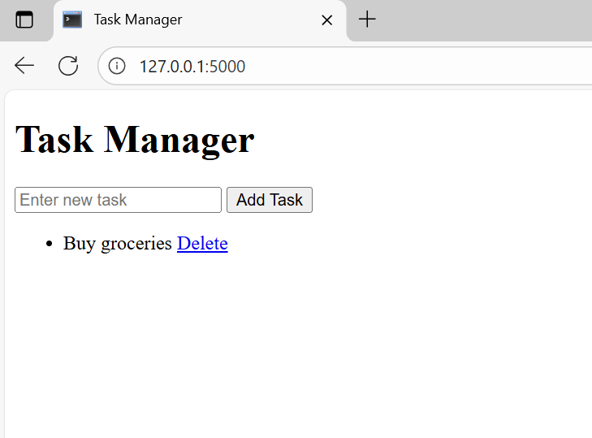
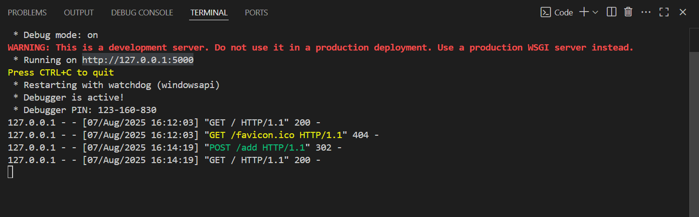

# 📝 Task Manager Web App

This is a simple Task Manager web application built using **Flask** (Python).  
It allows users to **add and view tasks**, with data saved locally in a `tasks.json` file.

---

## 🚀 Features
- Add new tasks
- View all saved tasks
- Persistent storage using JSON

---

## 📂 Project Structure
TaskManagerApp/
│
├── app.py # Flask backend logic
├── tasks.json # Stores tasks data
├── templates/
│ └── index.html # HTML + Jinja2 template
├── static/ # Folder for screenshots or assets (optional)
│ ├── app_screenshot.png # Screenshot of the web app
│ └── terminal_screenshot.png # Screenshot of the terminal
└── README.md # Project documentation
---

## 🛠️ Tech Stack
- Python
- Flask
- HTML (Jinja2 Templating)
- JSON

---

## ▶️ How to Run Locally

1. Clone or download this repo  
2. Open terminal in the project folder  
3. Run:

```bash
pip install flask
python app.py

Open your browser and go to http://127.0.0.1:5000

📸 Screenshots
### Task Manager Web App






Created by [Ayush Kumar Singh]  
🔗 [Connect on LinkedIn](https://www.linkedin.com/in/ayush-kumar-singhxx)  
📧 Email: ayushkrsingh4x@gmail.com
